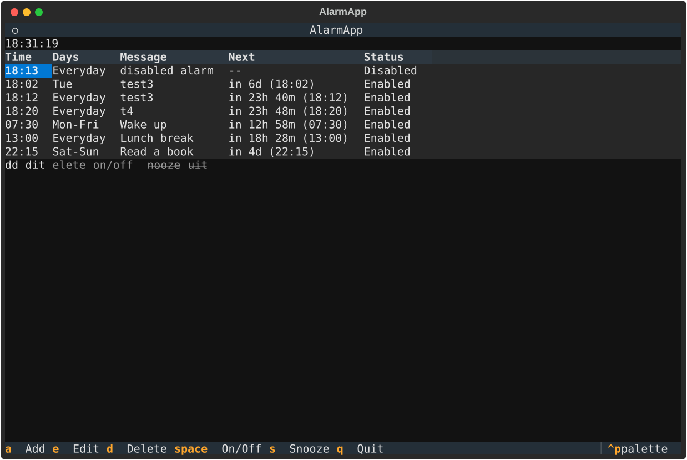
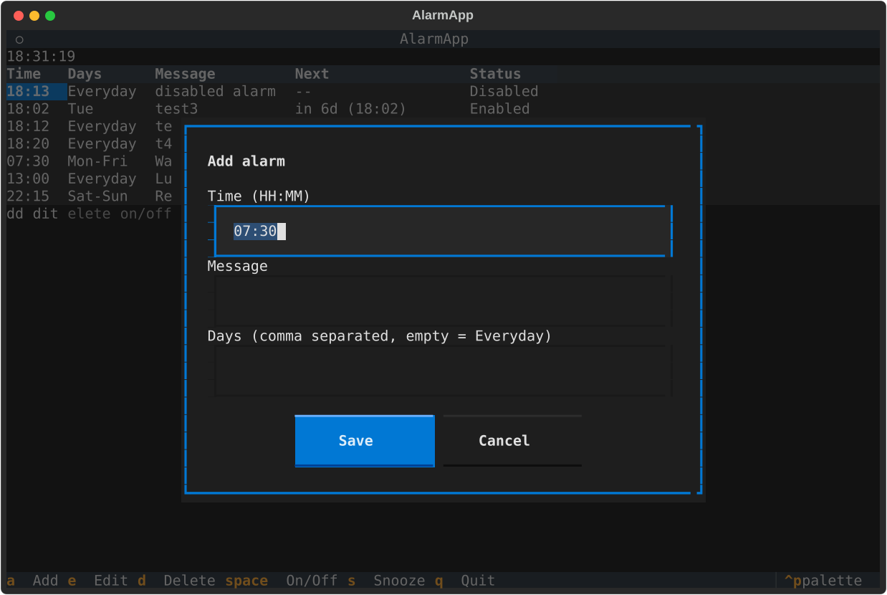
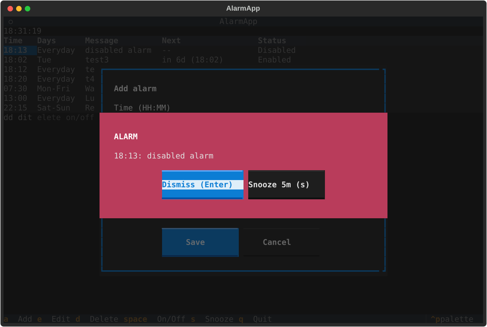

# py-alarm-cli

Portable Python alarm clock with a full-screen terminal user interface (TUI).
Set multiple alarms, manage them entirely from the TUI, persisted in JSON.
When an alarm fires, the popup flashes and the bell keeps ringing until you
dismiss or snooze it. Works on Windows, macOS, and Linux.

Built with [Textual](https://textual.textualize.io/), developed test-first
with `pytest` (55 tests).

## Features

- Full-screen Textual TUI — the only control surface, no CLI flags to learn
- Multiple alarms: time (`HH:MM`), weekdays or everyday, message, on/off
- Live current time (`HH:MM:SS`) plus per-alarm next-ring countdown and status
- Ringing alarm popup flashes red and re-rings the terminal bell every second
  until dismissed (`Enter`) or snoozed 5 min (`s`)
- JSON persistence (`./alarms.json`), atomic saves, corrupt-file backup
- Debug logging to stderr plus `./py-alarm-cli.log` in the current directory
- Cross-platform bell: terminal `\a` everywhere, best-effort OS hook that never raises

## Screenshots

Main alarm list with live clock, countdown, and status:



Add / edit form with a themed border:



Ringing alarm — flashing red popup, bell repeats until dismissed or snoozed:



## Requirements

- Python 3.9+
- Dependencies: `textual>=3` (dev: `pytest`, `pytest-asyncio`, `pytest-cov`)

## Install & run

```bash
git clone <your-repo-url>
cd py-alarm-cli
python -m venv env
./env/bin/python -m pip install -e ".[dev]"

# launch the TUI (any of these)
./env/bin/py-alarm
./env/bin/python main.py
./env/bin/python -m py_alarm_cli
```

## TUI keybindings

| Key     | Action                              |
| ------- | ----------------------------------- |
| `a`     | Add alarm                           |
| `e`     | Edit highlighted alarm              |
| `d`     | Delete highlighted alarm (confirm)  |
| `space` | Enable / disable highlighted alarm  |
| `s`     | Snooze highlighted alarm 5 min      |
| `q`     | Quit (everything is already saved)  |

Alarm popup: `Enter` dismiss, `s` snooze 5 min.

## Layout

```
py-alarm-cli/
  main.py                  # root entrypoint -> py_alarm_cli.app:main
  pyproject.toml
  specs/                   # design specs (00-overview ... 07-project-layout)
  src/py_alarm_cli/
    app.py                 # wiring: logging + repo + service + scheduler + TUI
    logger.py              # stderr + ./py-alarm-cli.log (PY_ALARM_LOG_LEVEL)
    core/
      models.py            # Alarm dataclass, validation, next_ring()
      service.py           # CRUD, enable/disable, snooze/dismiss, due_alarms()
      scheduler.py         # 1s tick, per-minute dedup
      ringer.py            # BellRinger protocol + TerminalBellRinger
    storage/json_repo.py   # ./alarms.json load/save, corrupt backup
    tui/
      app.py               # AlarmApp: table, clock, keybindings, poll_alarms()
      screens.py           # themed modals (add/edit, delete, flashing ring)
      widgets.py           # pure format helpers
  tests/                   # pytest suite (TDD, fake clocks, Textual Pilot)
```

Runtime files (created in the directory you launch from, gitignored):
`alarms.json`, `alarms.json.corrupt-*.bak`, `py-alarm-cli.log*`.

## Configuration

| Env var            | Default | Purpose                        |
| ------------------ | ------- | ------------------------------ |
| `PY_ALARM_LOG_LEVEL` | `INFO` | `DEBUG` / `INFO` / `WARNING` / `ERROR` |

## Tests

```bash
./env/bin/python -m pytest -q
./env/bin/python -m pytest -q --cov=py_alarm_cli.core --cov=py_alarm_cli.storage --cov=py_alarm_cli.logger --cov-report=term --cov-fail-under=80
```

## Specs

Design decisions live in `specs/`: architecture, data model, TUI/UX,
scheduler & ringing, logging, testing/TDD, and project layout.
